# 🛒 Spring Boot E-Commerce API

<div align="center">

# 🛒 Spring Boot E-Commerce API 

### 📋 Production Ready E-Commerce REST API built with Spring Boot

<p align="center">


</p>

</div>

---


---

# 📖 Overview

Spring Boot E-Commerce API is a production-ready backend application built using **Java 21** and **Spring Boot**.

It provides secure REST APIs for an online shopping platform with **JWT Authentication**, **Refresh Token**, **Spring Security**, **Spring AI**, **Cloudinary Image Upload**, **Role-Based Authorization**, and **PostgreSQL**.

Customers can browse products, manage carts, maintain wishlists, place orders, update profiles, and interact with an AI shopping assistant, while administrators can manage products, categories, users, and customer orders.

The project follows a clean layered architecture and is deployed on **Railway** with **Swagger OpenAPI** for API documentation.


---

# 🌐 Live Demo

## 🚀 API Base URL

https://springboot-ecommerce-api-production-0832.up.railway.app

---

## 📚 Swagger UI

https://springboot-ecommerce-api-production-0832.up.railway.app/swagger-ui/index.html

---

# ✨ Features

# 🔐 Authentication

- User Registration
- Secure Login
- JWT Authentication
- Refresh Token Authentication
- Logout
- BCrypt Password Encryption
- Change Password
- Secure User Sessions

---

# 👤 User Management

- View User Profile
- Update User Profile
- Change Password
- Secure Profile APIs

---

# 🛍 Product Management

- Browse Products
- Get Product Details
- Search Products
- Filter Products by Category
- Product Image Upload using Cloudinary
- Product Management (Admin)

---

# 📂 Category Management

- Create Category
- Update Category
- Delete Category
- View Categories

---

# 🛒 Shopping Cart

- Add Product to Cart
- Update Cart Quantity
- Remove Cart Item
- Clear Cart
- View Shopping Cart

---

# ❤️ Wishlist

- Add Product to Wishlist
- Remove Product from Wishlist
- View Wishlist

---

# 📦 Order Management

- Place Order
- View User Orders
- View Order Details
- Update Order Status (Admin)

---

# 🤖 AI Shopping Assistant

The application integrates **Spring AI** to provide an intelligent shopping assistant.

Users can:

- Ask product-related questions
- Receive shopping recommendations
- Get AI-generated responses
- Improve shopping experience using natural language

---

# ☁️ Cloudinary Integration

Product images are securely uploaded and stored using **Cloudinary**.

Features include:

- Cloud Image Storage
- Secure Image URLs
- Fast CDN Delivery
- Easy Image Management

---

# 🔒 Security

- Spring Security
- JWT Authentication
- Refresh Token Authentication
- Role-Based Authorization
- Secure REST APIs
- Authentication Filters
- Protected Endpoints

---

# 🛠 Tech Stack

| Technology | Used |
|------------|------|
| ☕ Java 21 | ✅ |
| 🌱 Spring Boot | ✅ |
| 🔐 Spring Security | ✅ |
| 🤖 Spring AI | ✅ |
| 🗄 Spring Data JPA | ✅ |
| 🐘 PostgreSQL | ✅ |
| 🛢 Hibernate | ✅ |
| 🔑 JWT | ✅ |
| ♻ Refresh Token | ✅ |
| ☁️ Cloudinary | ✅ |
| 📚 Swagger OpenAPI | ✅ |
| 🚂 Railway | ✅ |
| 📦 Maven | ✅ |
| 🧩 Lombok | ✅ |
| ✅ Bean Validation | ✅ |

---

# 🧩 Architecture

```

Controller

↓

Service

↓

Repository

↓

PostgreSQL Database

```

---

# 🔑 Authorization

The application uses **Role-Based Access Control (RBAC).**

| Role | Permissions |
|------|-------------|
| 👑 ADMIN | Full Access |
| 👤 USER | Shopping Features Only |

Authentication is performed using **JWT Bearer Token.**

Every protected API requires:

```

Authorization: Bearer YOUR_ACCESS_TOKEN

```
---

# 📡 REST API Documentation

## 🔐 Authentication APIs

| Method | Endpoint | Access | Description |
|---------|----------|--------|-------------|
| POST | `/api/auth/register` | Public | Register a new user |
| POST | `/api/auth/login` | Public | Login and receive Access Token & Refresh Token |
| POST | `/api/auth/refresh` | Public | Generate new Access Token |
| POST | `/api/auth/logout` | Authenticated | Logout user |
| PUT | `/api/auth/change-password` | Authenticated | Change account password |

---

# 👤 User Profile APIs

| Method | Endpoint | Access | Description |
|---------|----------|--------|-------------|
| GET | `/api/user/profile` | USER | Get logged-in user profile |
| PUT | `/api/user/profile` | USER | Update profile information |

---

# 🛍 Product APIs

| Method | Endpoint | Access | Description |
|---------|----------|--------|-------------|
| GET | `/api/products` | Public | Get all products |
| GET | `/api/products/{id}` | Public | Get product details |
| GET | `/api/products/search` | Public | Search products |
| GET | `/api/products/category/{categoryId}` | Public | Get products by category |

---

# 📂 Category APIs

| Method | Endpoint | Access | Description |
|---------|----------|--------|-------------|
| GET | `/api/categories` | Public | Get all categories |
| GET | `/api/categories/{id}` | Public | Get category by ID |

---

# 🛒 Shopping Cart APIs

| Method | Endpoint | Access | Description |
|---------|----------|--------|-------------|
| POST | `/api/cart/add` | USER | Add product to cart |
| GET | `/api/cart` | USER | View cart |
| PUT | `/api/cart/update/{cartItemId}` | USER | Update cart quantity |
| DELETE | `/api/cart/remove/{cartItemId}` | USER | Remove cart item |
| DELETE | `/api/cart/clear` | USER | Clear entire cart |

---

# ❤️ Wishlist APIs

| Method | Endpoint | Access | Description |
|---------|----------|--------|-------------|
| POST | `/api/user/wishlist/{productId}` | USER | Add product to wishlist |
| DELETE | `/api/user/wishlist/{productId}` | USER | Remove product from wishlist |
| GET | `/api/user/wishlist` | USER | View wishlist |

---

# 📦 Order APIs

| Method | Endpoint | Access | Description |
|---------|----------|--------|-------------|
| POST | `/api/orders` | USER | Place order |
| GET | `/api/orders` | USER | View order history |
| GET | `/api/orders/{orderId}` | USER | Get order details |

---

# 🤖 AI Assistant API

| Method | Endpoint | Access | Description |
|---------|----------|--------|-------------|
| POST | `/api/user/ai/ask` | USER | Ask AI shopping assistant |

---

# 👑 Admin Category APIs

| Method | Endpoint | Access | Description |
|---------|----------|--------|-------------|
| POST | `/api/admin/categories` | ADMIN | Create category |
| PUT | `/api/admin/categories/{id}` | ADMIN | Update category |
| DELETE | `/api/admin/categories/{id}` | ADMIN | Delete category |

---

# 👑 Admin Product APIs

| Method | Endpoint | Access | Description |
|---------|----------|--------|-------------|
| POST | `/api/admin/products` | ADMIN | Create product |
| PUT | `/api/admin/products/{id}` | ADMIN | Update product |
| DELETE | `/api/admin/products/{id}` | ADMIN | Delete product |
| POST | `/api/admin/products/{id}/upload-image` | ADMIN | Upload product image to Cloudinary |

---

# 👑 Admin Management APIs

| Method | Endpoint | Access | Description |
|---------|----------|--------|-------------|
| GET | `/api/admin/users` | ADMIN | Get all registered users |
| GET | `/api/admin/orders` | ADMIN | View all orders |
| GET | `/api/admin/orders/{id}` | ADMIN | Get order by ID |
| PUT | `/api/admin/orders/{id}/status` | ADMIN | Update order status |

---

# 🔒 API Security

Every protected endpoint uses

- 🔑 JWT Bearer Authentication
- 🔄 Refresh Token Authentication
- 🔐 Spring Security
- 👥 Role Based Authorization
- 🔒 BCrypt Password Encryption

---

# 👑 Authorization Rules

## 👑 ADMIN

✔ Manage Categories

✔ Manage Products

✔ Upload Product Images

✔ Manage Orders

✔ View Users

✔ Update Order Status

✔ Full System Access

---

## 👤 USER

✔ Register

✔ Login

✔ Refresh Token

✔ Logout

✔ Browse Products

✔ Search Products

✔ Manage Wishlist

✔ Manage Shopping Cart

✔ Place Orders

✔ View Order History

✔ Update Profile

✔ Change Password

✔ Use AI Shopping Assistant

---

# 🛡 Security Features

- 🔐 Spring Security
- 🔑 JWT Authentication
- 🔄 Refresh Token Authentication
- 🔒 BCrypt Password Encryption
- 👥 Role Based Authorization
- 🚫 Unauthorized Access Protection
- 🌐 CORS Configuration
- 🧹 Global Exception Handling
- ✅ Bean Validation
- 🧩 Custom UserDetailsService
- 🛡 JWT Filter
- 🔐 Secure REST APIs

---

# 📂 Project Structure

```text
src
├── config
├── controller
│   ├── admin
│   ├── auth
│   └── user
├── dto
│   ├── request
│   └── response
├── entity
├── enums
├── exception
├── repository
├── security
│   ├── jwt
│   └── userdetails
├── service
│   └── impl
├── util
└── SpringbootEcommerceApiApplication
```

---

# 🗄 Database

The application uses **PostgreSQL** as the primary relational database.

## Main Tables

- 👤 users
- 🔑 refresh_tokens
- 📂 categories
- 📦 products
- 🛒 cart_items
- ❤️ wishlists
- 📦 orders
- 📦 order_items

---

## Relationships

```text
User
 │
 ├────────< CartItem
 │
 ├────────< Wishlist
 │
 └────────< Order
                 │
                 └────────< OrderItem

Category
      │
      └────────< Product
```

---

# 🔄 Request Flow

```text
Client

   │

   ▼

Controller

   │

   ▼

Service

   │

   ▼

Repository

   │

   ▼

PostgreSQL Database
```

---

# 🧪 API Testing

The API has been tested using

- 📚 Swagger UI
- 📮 Postman
- 🌐 Browser

All secured endpoints require

```text
Authorization: Bearer YOUR_ACCESS_TOKEN
```

---

# 📈 Production Deployment

| Service | Status |
|----------|--------|
| 🚀 Railway Deployment | ✅ |
| 🐘 PostgreSQL | ✅ |
| ☁ Cloudinary | ✅ |
| 📚 Swagger UI | ✅ |
| 🔐 JWT Authentication | ✅ |
| 🔄 Refresh Token | ✅ |
| 🤖 AI Shopping Assistant | ✅ |
| 🌍 REST APIs | ✅ |
| 👥 Role Based Authorization | ✅ |

---
# ⚙️ Getting Started

## 1️⃣ Clone Repository

```bash
git clone https://github.com/jeevan-kaware/springboot-ecommerce-api.git

cd springboot-ecommerce-api
```

---

# 2️⃣ Configure PostgreSQL Database

Create a PostgreSQL database (Local PostgreSQL or Railway PostgreSQL).

Update your `application.properties` or `application.yml`

```properties
spring.datasource.url=<YOUR_DATABASE_URL>
spring.datasource.username=<YOUR_DATABASE_USERNAME>
spring.datasource.password=<YOUR_DATABASE_PASSWORD>
```

---

# 3️⃣ Configure JWT

```properties
jwt.secret=<YOUR_SECRET_KEY>
jwt.expiration=86400000
jwt.refresh-expiration=604800000
```

---

# 4️⃣ Configure Cloudinary

```properties
cloudinary.cloud-name=<YOUR_CLOUD_NAME>
cloudinary.api-key=<YOUR_API_KEY>
cloudinary.api-secret=<YOUR_API_SECRET>
```

---

# 5️⃣ Configure Spring AI

```properties
spring.ai.openai.api-key=<YOUR_AI_API_KEY>
```

---

# 6️⃣ Run the Project

Using Maven

```bash
./mvnw spring-boot:run
```

or

```bash
mvn spring-boot:run
```

---

# 📖 Open Swagger

## Local

```
http://localhost:8080/swagger-ui/index.html
```

## Production

```
https://springboot-ecommerce-api-production-0832.up.railway.app/swagger-ui/index.html
```

---

# 🌍 Live Deployment

| Service | URL |
|----------|-----|
| 🚀 Railway | https://springboot-ecommerce-api-production-0832.up.railway.app |
| 📚 Swagger UI | https://springboot-ecommerce-api-production-0832.up.railway.app/swagger-ui/index.html |

---

# 📸 Screenshots

The following screenshots demonstrate the core functionality of the application.

## 📚 Swagger UI

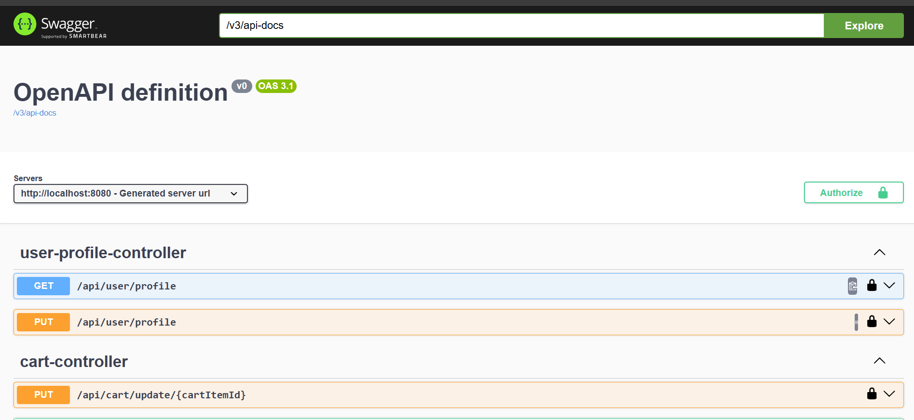
---

## 👤 User Registration

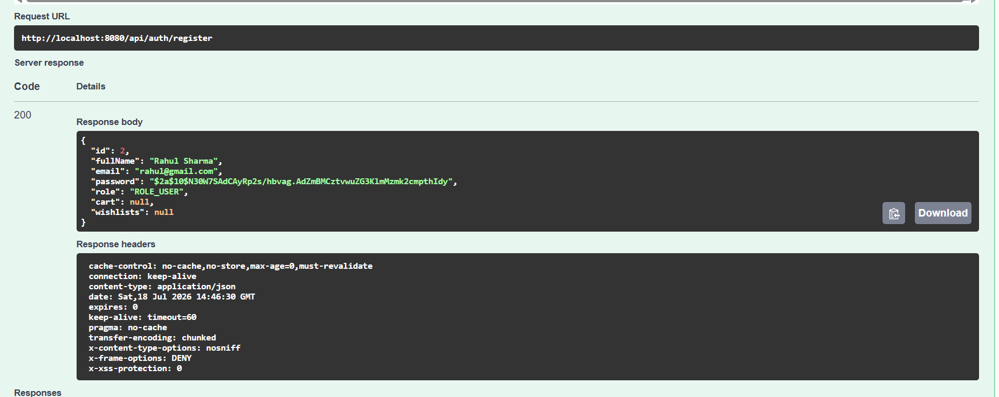
---

## 🔐 User Login

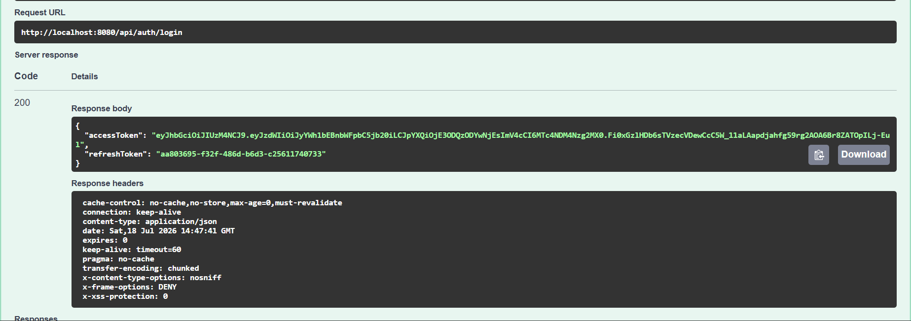
---

## 🛍 Product Listing

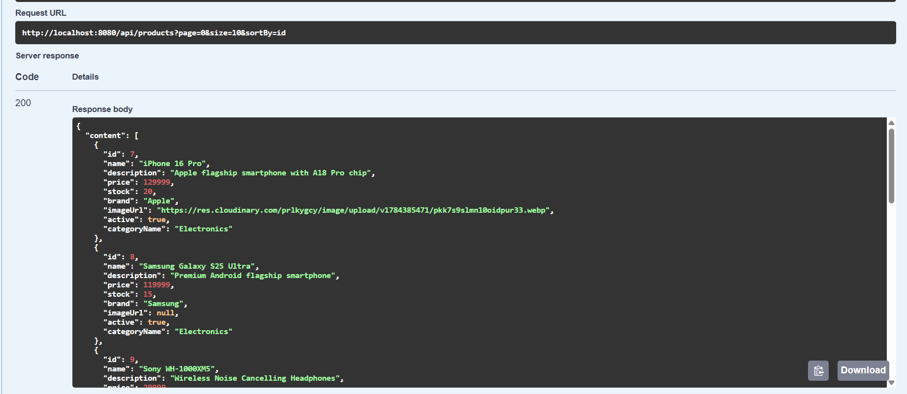
---

## ➕ Create Product (Admin)

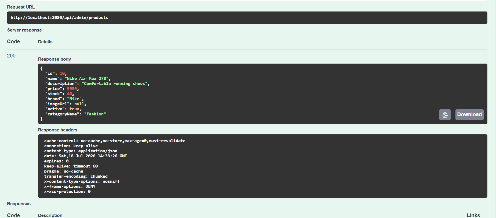
---

## ☁ Upload Product Image

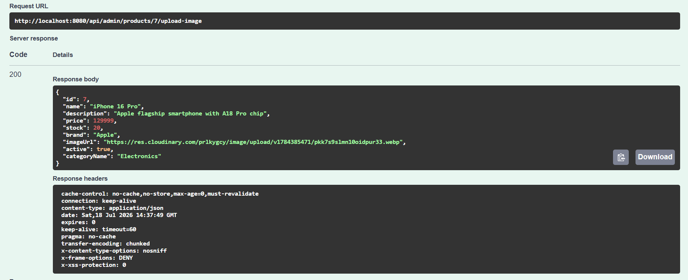
---

## 🛒 Add Product to Cart

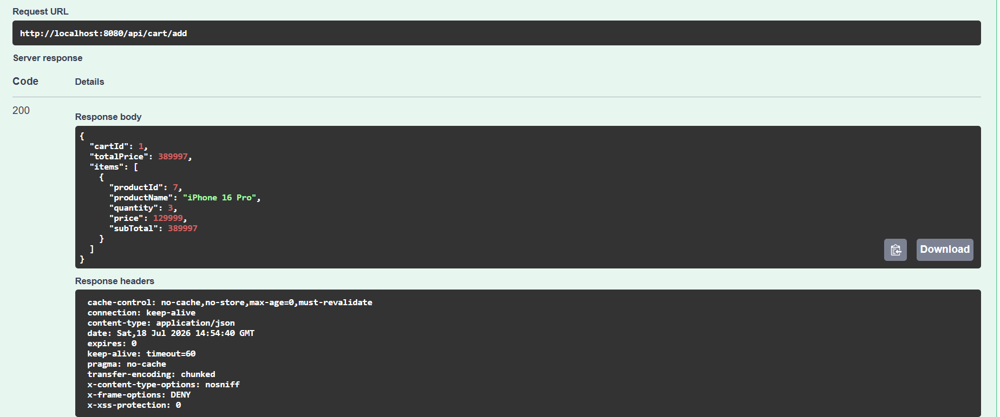
---

## 🛍 View Shopping Cart

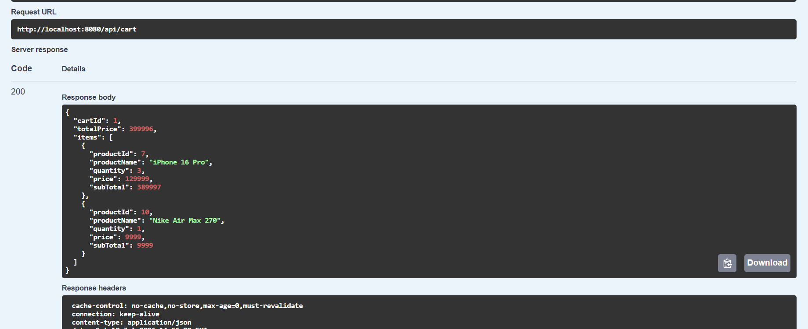
---

## 📦 Place Order

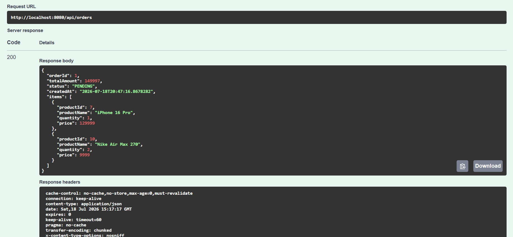
---

## 👑 Update Order Status

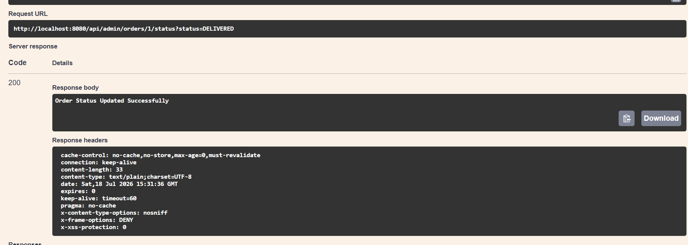
---

## 🤖 AI Shopping Assistant

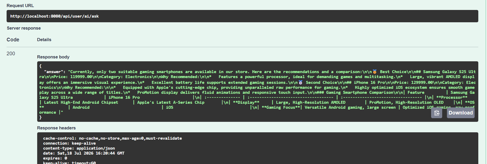
---

## 👤 User Profile

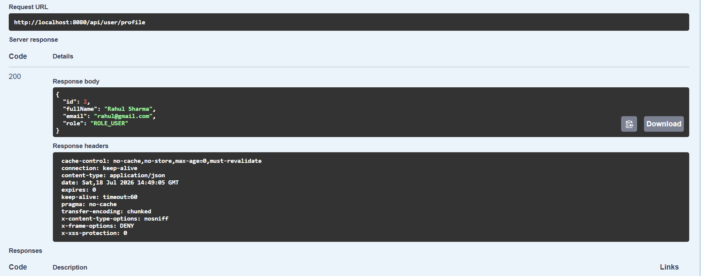
---

# 🚀 Future Improvements

The following features are planned for future releases.

💳 Payment Gateway (Stripe / Razorpay)

⭐ Product Reviews & Ratings

📦 Inventory Management

📱 Mobile App Backend

🌍 React Frontend

📧 Email Notifications

🔔 Push Notifications

🧠 AI Product Recommendations

🛒 Checkout Module

🎟 Coupons & Discounts

📑 PDF Invoice Generation

🚚 Shipment Tracking

🏪 Multi Vendor Marketplace

⚡ Redis Caching

📊 Dashboard Analytics

🐳 Docker

☸ Kubernetes

⚙ GitHub Actions CI/CD

🧪 Unit Testing

🔄 Integration Testing

📈 Monitoring & Logging

🔍 Elasticsearch Search

🧾 Order Reports

---

# 💡 Learning Outcomes

This project helped me gain practical experience with

- Java 21
- Spring Boot
- Spring Security
- JWT Authentication
- Refresh Token Flow
- Spring AI
- Cloudinary Integration
- REST API Development
- PostgreSQL
- Spring Data JPA
- Hibernate
- Maven
- Swagger OpenAPI
- Railway Deployment
- Exception Handling
- Bean Validation
- Clean Layered Architecture
- Role Based Authorization
- Secure Backend Development
- Production Ready REST API Design

---

# 👨‍💻 Author

## Jeevan Kaware

**Java Backend Developer**

### 🌐 GitHub

https://github.com/jeevan-kaware/springboot-ecommerce-api

### 💼 LinkedIn

https://www.linkedin.com/in/jeevan-kaware-080643355

### 🌍 Portfolio

Coming Soon...

---

# ⭐ Support

If you found this project helpful, please consider giving it a **⭐ Star** on GitHub.

It motivates me to build more production-ready backend applications and continuously improve my backend development skills.

---

# ❤️ Built With

- ☕ Java 21
- 🌱 Spring Boot
- 🔐 Spring Security
- 🔑 JWT Authentication
- 🔄 Refresh Token
- 🤖 Spring AI
- ☁ Cloudinary
- 🐘 PostgreSQL
- 🛢 Hibernate
- 📚 Swagger OpenAPI
- 🚂 Railway
- 📦 Maven

---

# 🙏 Thank You

Thank you for visiting this repository.

I hope this project helps you learn how to build a secure, scalable, and production-ready E-Commerce REST API using the Spring Boot ecosystem.

Happy Coding! 🚀
